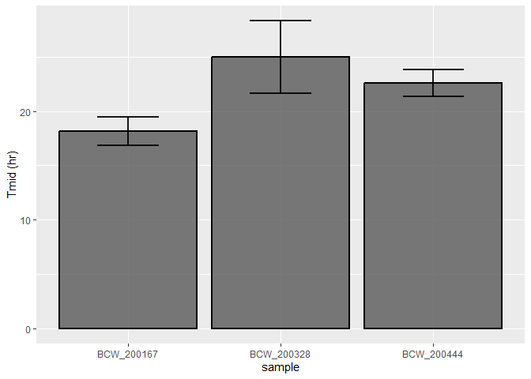

# 2023 Growth Curve Analysis

### Import packages and set working directory.

##### R

```r
knitr::opts_knit$set(root.dir = rprojroot::find_rstudio_root_file())
library(reticulate)
library(growthcurver)
library(ggplot2)
```

##### Python

```python
import pandas as pd
import numpy as np
import os
```

##### Growth Curve Data. Specify what date to analyze.

```python
date = "03-15-2022"
data = pd.read_csv("data/clean-data/Growth Curve 96 well_"+date+".csv")
blank_well_index = (int(pd.read_csv("data/blanks/growth-curve-blank_"+date+".csv").columns[0]))
# Blank values of used wells - Triplicate. 
blank_wells = data.iloc[(blank_well_index - 3): blank_well_index]
blank_well_mean = blank_wells.agg(np.mean)
```

```
## <string>:1: FutureWarning: Dropping of nuisance columns in DataFrame reductions (with 'numeric_only=None') is deprecated; in a future version this will raise TypeError.  Select only valid columns before calling the reduction.
```

```python
data_primed = data.drop("Time (sec)", axis =1)
blanked_GC = np.subtract(data_primed, blank_well_mean)
ready_blanked_GC = blanked_GC.drop([blank_well_index-1, blank_well_index-2, blank_well_index-3])
# Rename columns to match isolates.
column_names = []
for i in pd.read_csv("data/columns/growth-curve-columns_" + date + ".csv"):
    column_names.append(i)
    column_names.append(i)
    column_names.append(i)
ready_blanked_GC = ready_blanked_GC.T
ready_blanked_GC.columns = column_names
ready_blanked_GC.index.name = "time"
ready_blanked_GC.to_csv("output/dataprep/GC_dataprep_"+date+".csv")
```

##### Into Growthcurver.

```r
date=py$date
file_name = paste("output/dataprep/GC_dataprep_",date,".csv",sep="")
d=read.table(file_name,header=TRUE,sep=",",stringsAsFactors = FALSE)
gc_out = SummarizeGrowthByPlate(d,
                                bg_correct = "none",
                                plot_fit=TRUE,
                                plot_file=paste("output/plot/GC_plot_",py$date,".pdf",sep=""))
output_name = paste("output/output/GC_output_",py$date,".csv",sep="")
write.table(gc_out,output_name,quote=FALSE,sep=",",row.names=FALSE)
```

##### Retrieve average values for isolates.

```python
data = pd.read_csv("output/output/GC_output_"+date+".csv")
new_set = [x.replace(".1", "").replace(".2", "") for x in data["sample"]]
data["sample"] = new_set
#Create dataframe with mean, std, and sem values.
mu_mean = data.groupby(data["sample"]).mean()
mu_mean = mu_mean.rename(columns={"r":"mu"})

mu_std = data.groupby(data["sample"]).std()
mu_std = mu_std.rename(columns={"r":"mu_std","t_mid":"t_mid_std"})
mu_std = mu_std[["mu_std","t_mid_std"]]

mu_sem = data.groupby(data["sample"]).sem()
mu_sem = mu_sem.rename(columns={"r":"mu_sem","t_mid":"t_mid_sem"})
mu_sem = mu_sem[["mu_sem","t_mid_sem"]]

mu_analyzed = pd.concat([mu_mean, mu_std, mu_sem], axis=1)
mu_analyzed.to_csv("output/analyzed/GC_analyzed_" + date + ".csv")
```

##### Plot average t_mid.

```r
date=py$date
data = read.csv(paste("output/analyzed/GC_analyzed_",date,".csv",sep=""))
ggplot(data=data,aes(x=sample,y=t_mid)) +
  geom_bar(position=position_dodge(),
           stat="identity",
           color="black",
           size=1,
           alpha=0.8) +
  geom_errorbar(aes(x=sample,
                    ymin=t_mid-t_mid_std,
                    ymax=t_mid+t_mid_std),
                width=0.4,
                colour="black",
                alpha=0.9,
                size=1,
                position=position_dodge(0.9)) +
  ylab("Tmid (hr)")
```

```
## Warning: Using `size` aesthetic for lines was deprecated in ggplot2 3.4.0.
## ℹ Please use `linewidth` instead.
```

<!-- -->

```r
ggsave(filename=paste("GC_tmid_",date,".png",sep=""),
       device="png",
       path="output/tmid/")
```

```
## Saving 7 x 5 in image
```
